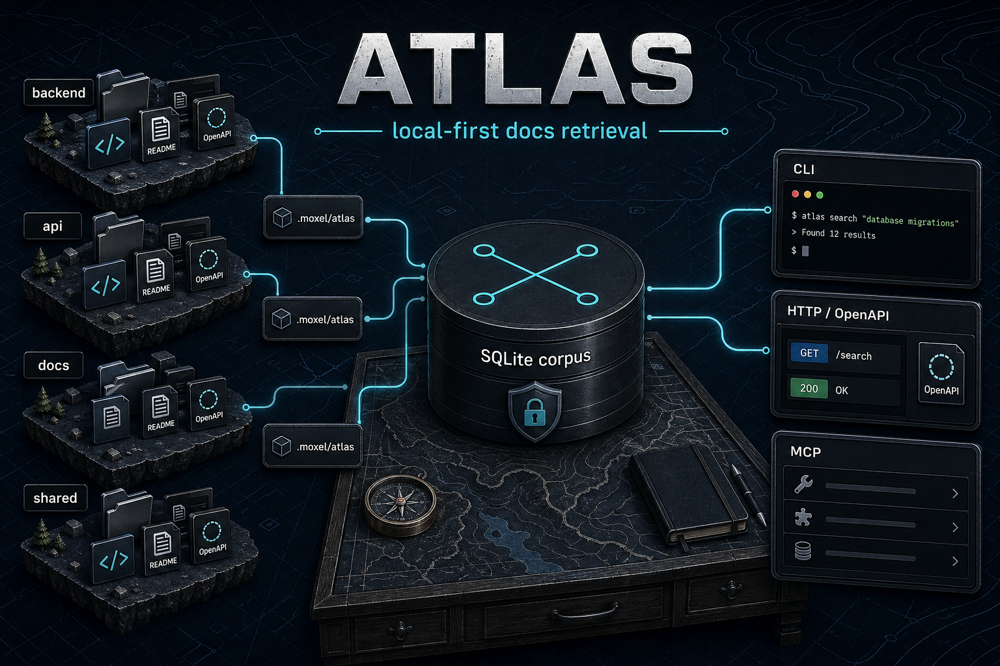

# Atlas

Atlas is a local-first documentation compiler, retrieval planner, and MCP/server runtime for multi-repo engineering docs.

Atlas helps teams publish ready-to-query documentation artifacts, import those artifacts without cloning full repositories, and serve high-signal context to CLI, HTTP, and MCP clients from a local SQLite corpus.

## Why local-first docs retrieval matters

Engineering docs often live across many repos, private hosts, and local checkouts. Atlas keeps retrieval predictable by compiling docs into local artifacts and querying local storage at runtime. Remote access happens only during explicit source sync, artifact fetch, or build workflows.

## Features

- Build committed public `.moxel/atlas` artifacts from docs and skills.
- Import maintained artifacts from GitHub or GitHub Enterprise Server without cloning full repositories.
- Search and plan retrieval context across one or many imported repos.
- Expose CLI, HTTP server, OpenAPI/Scalar docs, MCP tools, and [embedded Commander CLI mounts](https://github.com/moxellabs/atlas/blob/main/docs/enterprise-cli-mount.md).
- Support repo identity as `host/owner/name` for enterprise hosts.
- Filter public artifacts by document metadata and profile.
- Keep query-time surfaces local-first and credential-safe.

## Requirements

- Node.js 24+ for the installed npm package runtime (`atlas` binary runs as a Node bundle)
- Bun 1.3+ for source checkout development, build, and test workflows
- Git for local checkout workflows
- GitHub CLI or token env var only when explicit GHES/GitHub artifact fetch is needed

Atlas uses Bun in this repository for development, builds, tests, and source-run commands such as `bun run cli`. The published `@moxellabs/atlas` package is a Node 24+ runtime bundle. Its `better-sqlite3` dependency is intentional for Node runtime compatibility; do not casually replace it with `bun:sqlite` unless the project deliberately plans a Bun-only package/runtime migration.

## Install / run

Atlas publishes one public npm package, `@moxellabs/atlas`, with the `atlas` CLI binary. The npm tarball contains runtime assets only (`bin`, `dist`, README/license/security notices). It does not ship full `docs/**` or `.moxel/atlas/**`; import Atlas docs through the public repo artifact instead.

```bash
bunx @moxellabs/atlas --help
bunx @moxellabs/atlas repo add moxellabs/atlas
```

If installed globally or through another package manager, run the binary as `atlas`:

```bash
atlas setup
atlas repo add moxellabs/atlas
```

Run from source during development:

```bash
bun install
bun run cli --help
```

Validate workspace with the same checks used by public CI:

```bash
bun install --frozen-lockfile
bun run typecheck
bun run lint
bun test
bun run smoke:distribution
bun run release:check
bun apps/cli/src/index.ts artifact verify --fresh
```

See [CONTRIBUTING.md](https://github.com/moxellabs/atlas/blob/main/CONTRIBUTING.md) for contributor validation notes and [docs/release.md](https://github.com/moxellabs/atlas/blob/main/docs/release.md) for maintainer release process. Rebuild `.moxel/atlas` before artifact freshness verification when public docs or public skills change.

## Retrieval evals and dashboard

Atlas publishes deterministic MCP/retrieval eval reports from GitHub Actions. Run the full suite locally with `bun run eval` or the smoke subset with `bun run eval:quick`. See [docs/evals.md](https://github.com/moxellabs/atlas/blob/main/docs/evals.md) for commands, dataset layout, metrics, CI thresholds, and baseline policy.

When GitHub Pages is enabled, the latest dashboard is expected at https://moxellabs.github.io/atlas/. If Pages is not enabled, download the `atlas-eval-reports` artifact from the Evals workflow run.

## Quickstart: choose your path

Unsure what state you are in? Ask Atlas first:

```bash
atlas next
```

### I want to use docs from a repo

```bash
atlas setup --non-interactive
atlas repo add org/repo
atlas search "deployment rollback" --repo github.com/org/repo
atlas inspect retrieval --query "deployment rollback" --repo github.com/org/repo
```

`atlas add-repo` remains a compatibility alias for `atlas repo add`.

### I maintain a repo artifact

```bash
atlas init
atlas build --profile public
atlas artifact verify --fresh
```

### I need emergency local-only indexing

```bash
atlas index org/repo --repo-id github.com/org/repo
```

`atlas index` is a fallback when no maintained artifact exists. It builds a local-only corpus for your machine and is not the primary publishing path.

Runtime state lives under `~/.moxel/atlas` by default. Search, retrieval, MCP, and server reads use local imported corpus data.

## Maintainer artifact workflow

Maintainers can publish docs for consumers by committing `.moxel/atlas`:

```bash
atlas init
atlas build --profile public
atlas artifact inspect
atlas artifact verify --fresh
git add .moxel/atlas
```

From a source checkout, replace `atlas` with `bun run cli` for these commands.

`.moxel/atlas` contains `manifest.json`, `corpus.db`, `docs.index.json`, `checksums.json`, and `atlas.repo.json` when applicable. Public artifacts exclude internal planning, archive docs, docs marked `visibility: internal`, credentials, and machine-local paths by default.

Atlas never chooses branch names, commits, pushes, opens PRs, or bypasses organization review. Maintainers control normal Git workflow.

## Server and MCP usage

Start local server:

```bash
atlas serve
```

From a source checkout, use `bun run serve`.

Useful local routes:

- `/docs` - Scalar/OpenAPI docs experience
- `/openapi` - compatibility Scalar/OpenAPI route
- `/openapi.json` - raw OpenAPI document
- `/mcp` - HTTP MCP bridge when server is running

Run stdio MCP server:

```bash
atlas mcp
```

From a source checkout, use `bun run cli mcp`.

MCP and server reads operate over local corpus data.

## Docs map

The npm package does not include full `docs/**`. These links target repository docs on GitHub/source checkouts. For local searchable docs, run `atlas repo add moxellabs/atlas`.

- [Ingestion and build flow](https://github.com/moxellabs/atlas/blob/main/docs/ingestion-build-flow.md)
- [Runtime surfaces](https://github.com/moxellabs/atlas/blob/main/docs/runtime-surfaces.md)
- [Configuration](https://github.com/moxellabs/atlas/blob/main/docs/configuration.md)
- [Security](https://github.com/moxellabs/atlas/blob/main/docs/security.md)
- [Self-indexing](https://github.com/moxellabs/atlas/blob/main/docs/self-indexing.md)
- [Architecture](https://github.com/moxellabs/atlas/blob/main/docs/architecture.md)
- [MCP and retrieval evals](https://github.com/moxellabs/atlas/blob/main/docs/evals.md)
- [Server docs](https://github.com/moxellabs/atlas/blob/main/apps/server/docs/index.md)
- [CLI docs](https://github.com/moxellabs/atlas/blob/main/apps/cli/docs/index.md)

## Security guarantees

- Query-time search, retrieval, MCP, and HTTP reads do not fetch remote source content.
- Atlas does not upload indexed corpus content to external services.
- Tokens must not be stored in configs, logs, diagnostics, OpenAPI examples, MCP output, artifacts, fixtures, or issue templates.
- Public issue templates ask for sanitized reproductions only.

See [SECURITY.md](SECURITY.md) and [docs/security.md](https://github.com/moxellabs/atlas/blob/main/docs/security.md).

## Contributing and community

- [Contributing guide](https://github.com/moxellabs/atlas/blob/main/CONTRIBUTING.md)
- [Security policy](SECURITY.md)
- [Code of conduct](https://github.com/moxellabs/atlas/blob/main/CODE_OF_CONDUCT.md)
- [Pull request template](https://github.com/moxellabs/atlas/blob/main/.github/PULL_REQUEST_TEMPLATE.md)

## License

Atlas is licensed under AGPL-3.0-or-later. See [LICENSE](LICENSE) and [NOTICE](NOTICE).

Moxel, Moxel Labs, Atlas project branding, and related logos are trademarks or brand assets. Code license does not grant trademark rights or permission to imply official affiliation or endorsement.
